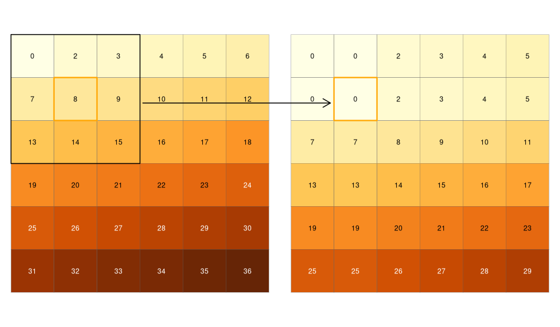

# GEOG 491/891: Special Topics - Spatial Analysis in R

## 

## Week 10.02: Raster algebra

### Dr. Bitterman

## 

---

# Today's schedule

- Open discussion
- Raster basics

---

## Anything to discuss? Questions?


---

# Remaining topics

- Week 10: Rasters (Friday: update presentations)
- Week 11: Making maps (Intro lab 4)
- Week 12: Interactive mapping (Intro lab 5)
- Week 13: Applications
- Week 14: Thanksgiving week
- Week 15: Applications
- Week 16: Project presentations

---

# Map algebra

Map algebra (or cartographic modeling) divides raster operations into four subclasses (Tomlin 1990), with each working on one or several grids simultaneously:

1. Local or per-cell operations

2. Focal or neighborhood operations. Most often the output cell value is the result of a 3 x 3 input cell block

3. Zonal operations are similar to focal operations, but the surrounding pixel grid on which new values are computed can have irregular sizes and shapes

4. Global or per-raster operations; that means the output cell derives its value potentially from one or several entire rasters

---

# Local operations

- Local operations comprise all cell-by-cell operations in one or several layers

- Raster algebra is a classical use case of local operations

---

# Let's try an example

### Setup
```r
library(tidyverse)
library(raster)
library(tmap)
```

### Load the same raster from last class
```r
myras <- raster::raster("./data/ts_2016.1007_1013.L4.LCHMP3.CIcyano.MAXIMUM_7day.tif")

plot(myras)
```
---

# A simple local operation

```r
myras * 2 
```
### How would you check your work?

---
# One way is to verify the ranges

```r
myras %>% values() %>% range(na.rm = T)

# What's different here?
(myras * 2) %>% values() %>% range(na.rm = T)
```

---
# Other simple local operations
```r
myras - 4
myras ** 2
log(myras)
```
### Essentially any alebraic operation works

---

# Reclassify

### First, let's setup our reclassification scheme

```r
rcl = matrix(c(0, 1, 0, 2, 249, 1, 250, 256, 0), ncol = 3, byrow = TRUE)
rcl
```
### What does it look like?

### Then apply it
```r
validdata = reclassify(myras, rcl = rcl)
validdata
plot(validdata)
```
### What do we have?

---

# How might this (essentially binary) raster be useful?

### Ideas?

---

# Let's multiply our "valid" raster with the original

### Expected output?

```r
validRaster <- myras * validdata
plot(validRaster)
```

---

# We can "do algebra" using a function too!

```r
# NOAA transform for CHAMPLAIN data
# valid as of 2019-02-01 metadata
transform_champlain_olci <- function(x){
  
  10**(((3.0 / 250.0) * x) - 4.2)
}

myras.ci <- validRaster %>% transform_champlain_olci
plot(myras.ci)
```

---

# Focal operations

- Focal operations take into account a central (focal) cell and  neighbors
- The neighborhood (also named kernel, filter, or moving window) can be any size/shape, but typically 3x3 grid
- operation applies aggregation function to all cells within the specified neighborhood
- function output is the new value for the the central cell, and moves on to the next central cell

---



*`(from https://geocompr.robinlovelace.net/spatial-operations.html#map-algebra)`*

---

# Example

### Let's break down the code
### How does it work conceptually?
```r
myras_focal = focal(myras.ci, w = matrix(1, nrow = 3, ncol = 3), fun = max)
plot(myras_focal)
```
### What does the new raster look like?

### How might we know what actually changed?

---

# Change detection

```r
(myras_focal - r_focal) %>% plot
```
### What assumptions does the comparison make?

---

# Good practice is to verify same extent, projection, resolution, and origin

```r
# good practice
compareRaster(myras_focal, r_focal)
```

---

# Global operations (are boring)

```r
raster::maxValue(myras.ci)
raster::minValue(myras.ci)

# or

myras.ci %>% raster::values() %>% mean(na.rm = T)

```
---

# Questions?

---

# Your task with the remaining time

- There is a second raster in the data folder
  - ```# ts_2016.0902_0908.L4.LCHMP3.CIcyano.MAXIMUM_7day.tif```
- Compare it to the image we've been using as `myras`

### Questions

- Did the cyanobacteria bloom get larger or smaller from the September image to the October image (see the filename for the image dates)?

- Report a statistic (of your choosing) that characterizes the change in bloom intensity between images


---

## For this week

- Friday: in-class update presentations... upload them to Canvas by the due date
- Readings posted on Canvas
- Practice, practice, practice
- Work on your projects

